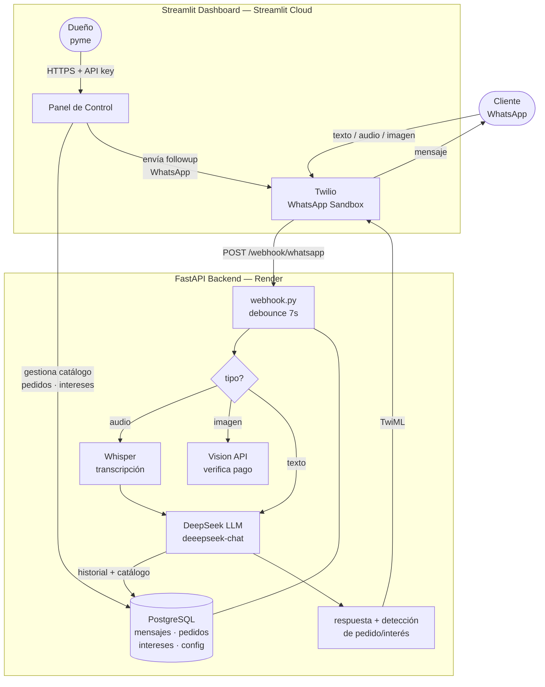

# RespondIA 🤖

> Agente de IA que atiende clientes por WhatsApp 24/7 para pymes peruanas, entrenado en minutos con el catálogo del negocio.

**Curso:** Data Science con Python 2026-I — Universidad del Pacífico  
**Autor:** Pietro Marcelo Nava Montenegro  
**Landing:** [pietronavam.github.io/respondIA](https://pietronavam.github.io/respondIA)  
**Panel:** [respond-ia.streamlit.app](https://respond-ia.streamlit.app/)  
**Backend API:** [respondia.onrender.com](https://respondia.onrender.com)

---

## El problema

El 95.6% de las pymes peruanas formales no vende por e-commerce y muchas gestionan pedidos por WhatsApp manualmente (EEA 2024, INEI). Un dueño de bodega o tienda pasa 4-6 horas al día respondiendo los mismos mensajes: precios, disponibilidad, horarios, delivery.

**Evidencia propia:** [Nava Montenegro (2026)](docs/) documenta que empresas con servicios digitales tienen 33% más productividad laboral que sus pares no-digitales (PSM, n=10,275), con una brecha que no se cierra sola.

## La solución

RespondIA conecta el WhatsApp del negocio con un agente de IA entrenado en el catálogo propio. En 5 minutos el dueño sube su lista de precios y el bot empieza a responder clientes automáticamente.

## Demo en vivo

Para probar el bot en WhatsApp:
1. Envía `join protection-memory` al número **+1 415 523 8886** (WhatsApp)
2. Escríbele al bot como si fueras un cliente (ej: "¿tienen polos talla M?")
3. Verifica la conversación en el [panel de control](https://respond-ia.streamlit.app/)

**Video demo (2 min):** _[ver docs/video_demo o YouTube]_

## Credenciales de prueba

| Rol | Acceso |
|---|---|
| Cliente WhatsApp | Envía `NABILA` al **+1 415 523 8886** |
| Panel del dueño | [respond-ia.streamlit.app](https://respond-ia.streamlit.app/) — email: `nabila@demo.com` / pass: `demo1234` |

## Herramientas del curso utilizadas

| Herramienta | Uso en el proyecto | Archivo |
|---|---|---|
| **DeepSeek API** (LLM, OpenAI-compatible SDK) | Genera respuestas inteligentes al cliente con historial + catálogo | `backend/app/services/claude_service.py` |
| **Whisper** (OpenAI speech-to-text) | Transcribe notas de voz de WhatsApp en español | `backend/app/services/whisper_service.py` |
| **Agente de mensajería tipo OpenClaw** | Bot conectado a WhatsApp via Twilio + debounce de mensajes | `backend/app/routes/webhook.py` |
| **FastAPI** | Backend REST + webhook de Twilio | `backend/app/main.py` |
| **Streamlit** | Dashboard de control para el dueño del negocio | `frontend/app.py` |
| **PostgreSQL** (Render) | Historial de conversaciones, pedidos, intereses, multi-tenant | `backend/app/database.py` |

## Arquitectura



## Cómo correr localmente

```bash
# 1. Clonar repo
git clone https://github.com/pietronavam/respondIA.git
cd respondIA

# 2. Configurar variables de entorno
cp .env.example .env
# Editar .env con tus keys (ver sección Variables de entorno)

# 3. Backend
cd backend
pip install -r requirements.txt
uvicorn app.main:app --reload

# 4. Frontend (nueva terminal)
cd frontend
pip install -r requirements.txt
streamlit run app.py
```

## Variables de entorno

```env
DEEPSEEK_API_KEY=...
TWILIO_ACCOUNT_SID=...
TWILIO_AUTH_TOKEN=...
TWILIO_WHATSAPP_NUMBER=whatsapp:+14155238886
```

## Deploy

| Servicio | Plataforma | Config |
|---|---|---|
| Backend API | Render.com | Web Service · Python · rootDir=`backend` |
| Dashboard | Streamlit Community Cloud | branch `main` · file `frontend/app.py` |
| Landing page | GitHub Pages | branch `main` · folder `/docs` |

## Estructura del repositorio

```
respondIA/
├── backend/
│   ├── app/
│   │   ├── main.py                  # FastAPI app
│   │   ├── database.py              # PostgreSQL — historial + settings + multi-tenant
│   │   ├── routes/
│   │   │   ├── webhook.py           # Twilio WhatsApp webhook
│   │   │   ├── catalog.py           # Gestión de catálogo y settings
│   │   │   ├── orders.py            # Pedidos, intereses, followups
│   │   │   └── conversations.py     # Historial de chats
│   │   └── services/
│   │       ├── claude_service.py    # DeepSeek LLM (OpenAI-compatible SDK)
│   │       ├── followup_service.py  # Mensajes de seguimiento automáticos
│   │       ├── vision_service.py    # Verificación de pagos por imagen
│   │       └── whisper_service.py   # Whisper — transcripción de notas de voz
│   └── requirements.txt
├── frontend/
│   └── app.py                       # Streamlit dashboard
├── docs/
│   ├── index.html                   # Landing page (GitHub Pages)
│   ├── architecture.html            # Diagrama de arquitectura interactivo
│   └── research/
│       └── validacion.md            # Evidencia de validación del problema
├── data/
├── .env.example
└── render.yaml
```

---

*Construido con Claude Code como co-founder técnico virtual.*
